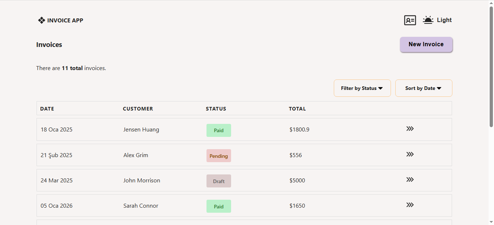
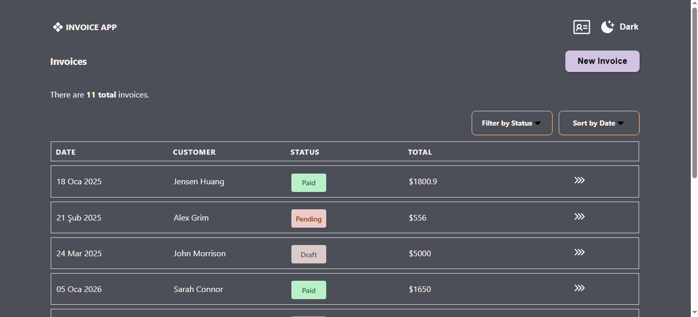

# Invoice App React

A simple yet functional **invoice management application** built with ReactJS.

## 🚀 Features

- Component-based architecture (ReactJS)
- Global state management (Redux)
- Custom lightweight utility CSS approach
- Responsive design (mobile, tablet, desktop)
- Light/Dark theme support

## 📸 Screenshot

#### Light Mode



#### Dark Mode



## ⚙️ Installation

Clone the project and install dependencies:

```bash
git clone <repo-url>
cd invoice-app-react
npm install
npm run dev


```
